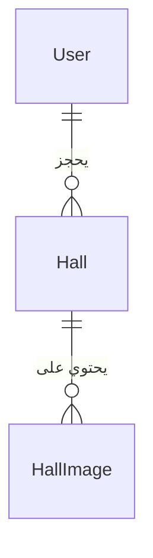

# نظام إدارة القاعات والمستخدمين – توثيق شامل للمشروع

## مقدمة

هذا المشروع عبارة عن نظام متكامل لإدارة قاعات المناسبات والمستخدمين، مبني باستخدام إطار عمل Django 5.x مع لوحة إدارة حديثة (Jazzmin). يتيح النظام إدارة القاعات، الصور، والمستخدمين بواجهات عصرية وسهلة الاستخدام، مع نظام مصادقة مرن يدعم تسجيل الدخول بالبريد الإلكتروني أو اسم المستخدم.

----
.
## المميزات الرئيسية

1. **لوحة الداشبورد والإدارة:**
   - أزرار تنقل عصرية وجذابة مع أيقونات ووصف لكل زر.
   - زر خاص لإدارة المستخدمين من الداشبورد.

2. **إدارة صور القاعات:**
   - نموذج HallImage مرتبط بنموذج القاعة (Hall) لرفع عدة صور لكل قاعة.
   - إدارة الصور من لوحة الإدارة (inline).
   - عرض صور القاعة في صفحة التفاصيل باستخدام سلايدر احترافي (Swiper.js) مع دعم Lightbox.

3. **نظام إدارة المستخدمين:**
   - صفحة إدارة مستخدمين عصرية (عرض، بحث، ترقيم، إحصائيات).
   - إمكانيات: إضافة، تعديل، حذف مستخدم مع صفحات منفصلة لكل عملية.
   - إحصائيات سريعة (إجمالي المستخدمين، المدراء، النشطين، غير النشطين).
   - صفحة تفاصيل المستخدم بتصميم عصري مع أفاتار تلقائي.
   - تحسين صفحة إضافة/تعديل المستخدم لتكون عصرية مع أفاتار تلقائي.

4. **لوحة الإدارة Jazzmin:**
   - استخدام Jazzmin كلوحة إدارة حديثة متوافقة مع Django 5.x.
   - تخصيص عنوان لوحة الإدارة ليكون "admin".
   - إزالة جميع آثار Django Jet.

5. **نظام المصادقة:**
   - تسجيل الدخول بالبريد الإلكتروني أو اسم المستخدم.
   - تسجيل جديد مع اسم مستخدم اختياري والتحقق من عدم التكراره.
   - توضيح إمكانية الدخول بأي من البريد أو اسم المستخدم في الواجهات.

---

## بنية المشروع

```
djangoTest/
│
├── core/                # إعدادات المشروع وملفات التشغيل
│   ├── settings.py
│   ├── urls.py
│   └── ...
├── hall_booking/        # التطبيق الرئيسي (إدارة القاعات والمستخدمين)
│   ├── models.py
│   ├── views.py
│   ├── templates/
│   └── ...
├── manage.py
└── db.sqlite3           # قاعدة البيانات الافتراضية (SQLite)
```

---

## شرح التطبيقات والموديولات

### 1. تطبيق core
- يحتوي على إعدادات المشروع (settings.py)، نقاط الدخول (asgi.py, wsgi.py)، وملفات التوجيه (urls.py).
- يتم فيه تعريف إعدادات قواعد البيانات، التطبيقات المثبتة، إعدادات Jazzmin، إعدادات اللغة، وغيرها.

### 2. تطبيق hall_booking
- التطبيق الرئيسي لإدارة القاعات والمستخدمين.
- يحتوي على النماذج (models)، العروض (views)، القوالب (templates)، ملفات static (إن وجدت)، وإعدادات الإدارة.

---

## شرح النماذج (Models)

### نموذج Hall
- يمثل القاعة ويحتوي على معلومات مثل الاسم، الموقع، السعة، التفاصيل، إلخ.

### نموذج HallImage
- يمثل صورة مرتبطة بقاعة معينة (علاقة ManyToOne).
- يسمح برفع عدة صور لكل قاعة.

### نموذج المستخدم (User)
- يعتمد غالبًا على User الافتراضي في Django مع تخصيصات (مثل دعم البريد الإلكتروني كوسيلة دخول).
- يحتوي على حقول إضافية مثل avatar، حالة التفعيل، الدور (مدير/مستخدم عادي)، إلخ.

---

## شرح العروض (Views) والوظائف الأساسية

- **عرض القاعات:** عرض قائمة القاعات مع إمكانية البحث والتصفية.
- **تفاصيل القاعة:** عرض تفاصيل القاعة مع سلايدر صور احترافي.
- **إدارة القاعات:** إضافة، تعديل، حذف قاعة (للمدراء).
- **إدارة المستخدمين:** عرض، بحث، ترقيم، إضافة، تعديل، حذف مستخدم.
- **إحصائيات:** عرض إحصائيات سريعة في لوحة الإدارة.
- **المصادقة:** تسجيل دخول بالبريد أو اسم المستخدم، تسجيل جديد، تسجيل خروج.

---

## شرح القوالب (Templates) وأهم الصفحات

- **الصفحة الرئيسية:** تعرض ملخصًا عن النظام وروابط سريعة.
- **صفحة القاعات:** قائمة القاعات مع صور مختصرة.
- **تفاصيل القاعة:** سلايدر صور (Swiper.js + Lightbox)، تفاصيل القاعة.
- **صفحة المستخدمين:** جدول عصري مع بحث وترقيم وإحصائيات.
- **صفحة تفاصيل المستخدم:** عرض معلومات المستخدم مع أفاتار تلقائي.
- **صفحات المصادقة:** تسجيل دخول وتسجيل جديد بتصميم عصري.

---

## إعدادات المشروع (settings.py)

- **إعدادات Jazzmin:** تخصيص عنوان لوحة الإدارة، الألوان، القوائم الجانبية.
- **إعدادات اللغة:** دعم اللغة العربية كلغة افتراضية.
- **إعدادات الملفات الثابتة (static/media):** دعم رفع الصور وتخزينها.
- **إعدادات المصادقة:** تخصيص AUTH_USER_MODEL إذا تم تخصيص نموذج المستخدم.

---

## نظام الصلاحيات والمصادقة

- **المصادقة:** تسجيل الدخول بالبريد الإلكتروني أو اسم المستخدم.
- **الصلاحيات:** تقسيم المستخدمين إلى مدراء ومستخدمين عاديين.
- **التحقق من الصلاحيات:** حماية صفحات الإدارة من الوصول غير المصرح به.

---

## تخصيصات لوحة الإدارة Jazzmin

- تخصيص عنوان اللوحة ليكون "admin".
- تخصيص القوائم الجانبية والألوان والشعار.
- إزالة جميع آثار Django Jet.

---

## آلية رفع الصور وعرضها

- رفع الصور يتم عبر نموذج HallImage المرتبط بالقاعة.
- الصور تظهر في صفحة تفاصيل القاعة باستخدام Swiper.js وLightbox.
- دعم رفع عدة صور دفعة واحدة.

---

## البحث والترقيم والإحصائيات

- **بحث:** دعم البحث في القاعات والمستخدمين من الواجهات.
- **ترقيم:** دعم ترقيم الصفحات (pagination) في القوائم الطويلة.
- **إحصائيات:** عرض إحصائيات سريعة في لوحة المستخدمين (إجمالي، نشط، غير نشط، مدراء).

---

## أمثلة على الاستخدام

### إضافة قاعة جديدة
1. من لوحة الإدارة، اختر "إضافة قاعة".
2. أدخل البيانات المطلوبة وارفع الصور.
3. احفظ القاعة وستظهر في القائمة.

### تسجيل مستخدم جديد
1. من صفحة التسجيل، أدخل البريد الإلكتروني وكلمة المرور (واسم المستخدم اختياري).
2. سيتم التحقق من عدم تكرار البريد واسم المستخدم.
3. بعد التسجيل يمكن الدخول مباشرة.

### رفع صور للقاعة
1. أثناء إضافة أو تعديل القاعة، يمكن رفع عدة صور.
2. الصور تظهر في تفاصيل القاعة بسلايدر احترافي.

---

## بنية قاعدة البيانات (مخطط مبسط)



---

## تعليمات التطوير والمساهمة

1. **تثبيت بيئة العمل:**
   - يفضل استخدام virtualenv أو venv.
2. **تثبيت المتطلبات:**
   ```bash
   pip install -r requirements.txt
   ```
3. **تشغيل الترحيلات:**
   ```bash
   python manage.py migrate
   ```
4. **تشغيل الخادم:**
   ```bash
   python manage.py runserver
   ```
5. **المساهمة:**
   - الرجاء الالتزام بمعايير الكود وكتابة تعليقات واضحة.
   - أي ميزة جديدة يجب أن تكون مدعومة باختبارات (اختياري).

---

## معلومات التواصل والدعم

- المطور الرئيسي: [اسمك هنا]
- البريد الإلكتروني: [بريدك هنا]
- للمساهمة أو الإبلاغ عن مشكلة: الرجاء فتح Issue على مستودع المشروع أو التواصل عبر البريد.

---

> يمكنك تخصيص هذا الملف بإضافة اسمك أو أي تفاصيل إضافية حسب الحاجة. إذا رغبت في شرح أي جزء بمزيد من التفصيل، لا تتردد في الطلب! 